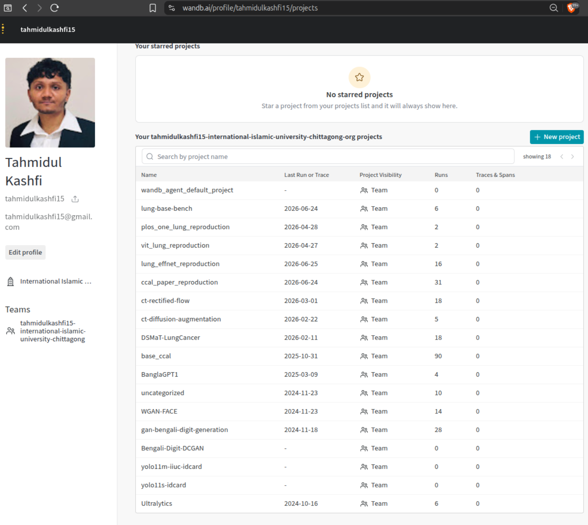

# Machine learning experiment log

Tahmidul Bin Ferdous, Department of Computer Science and Engineering,
International Islamic University Chittagong.

This repository is the working record behind my undergraduate research: 250 training
runs across 14 projects, logged to Weights & Biases between 2024-10 and 2026-06,
together with the code that produced them and the figures they generated.

Every run was trained on free-tier Kaggle accelerators (Tesla T4 or TPU v3-8), so
each project directory carries the notebook or script exactly as it ran there.

## When this work was done

This repository was put together in September 2026, so its commit history starts then. The
experiments are older. Every run was logged to Weights & Biases while it trained, and W&B
stamps each run on its own servers, so the dates below come from W&B and not from git.

The `created_at` column of every `runs.csv` holds the W&B timestamp of each run, and the
`wandb_url` column links to the run itself.

## How to read this

Each project directory contains:

| Path | Contents |
| --- | --- |
| `README.md` | what the project was for, and a table of every run with its headline metric |
| `runs.csv` | the full record: one row per run, every hyperparameter and every logged metric |
| `figures/` | evaluation figures, grouped by run |
| `code/` | the training code as it ran on Kaggle |
| `weights/` | the final checkpoint, or a link to it |

`runs.csv` is the primary evidence. It is exported directly from the Weights & Biases
API and is not edited by hand.

[`notebooks/`](notebooks/) holds the Kaggle notebooks that are not tied to a logged
project: exploratory probes, one-off experiments, coursework and practice, grouped by
topic. Everything the author has written on Kaggle is here, including the work that
did not lead anywhere.

Checkpoints are kept at one per project. Intermediate epoch checkpoints stay in
Weights & Biases rather than in this repository.

## Projects

| Project | Runs | Period | What it is |
| --- | --- | --- | --- |
| [lung-base-bench](projects/lung-base-bench/) | 6 | 2026-06 to 2026-06 | Shuffled vs ordered split, matched ratios, three seeds. The corrected headline result. |
| [plos_one_lung_reproduction](projects/plos_one_lung_reproduction/) | 2 | 2026-04 to 2026-04 | Four-block CNN from the PLOS ONE paper, both split conditions. |
| [vit_lung_reproduction](projects/vit_lung_reproduction/) | 2 | 2026-04 to 2026-04 | ViT-B/16 under both split conditions. |
| [lung_effnet_reproduction](projects/lung_effnet_reproduction/) | 16 | 2026-04 to 2026-06 | EfficientNet B0-B4 under both split conditions. |
| [ccal_paper_reproduction](projects/ccal_paper_reproduction/) | 31 | 2026-04 to 2026-06 | Reimplementation of the CCAL dual-CNN attention model. |
| [ct-rectified-flow](projects/ct-rectified-flow/) | 18 | 2026-02 to 2026-03 | Rectified flow generative model for CT slice augmentation. |
| [ct-diffusion-augmentation](projects/ct-diffusion-augmentation/) | 5 | 2026-02 to 2026-02 | DDPM for CT slice augmentation. |
| [DSMaT-LungCancer](projects/DSMaT-LungCancer/) | 18 | 2026-02 to 2026-02 | Depthwise state-space (Mamba) classifier on the lung CT dataset. |
| [base_ccal](projects/base_ccal/) | 90 | 2025-09 to 2025-10 | First CCAL implementation and hyperparameter search. |
| [BanglaGPT1](projects/BanglaGPT1/) | 4 | 2025-03 to 2025-03 | Small GPT trained from scratch on Bengali text. |
| [uncategorized](projects/uncategorized/) | 10 | 2024-11 to 2024-11 | Early exploratory runs. |
| [WGAN-FACE](projects/WGAN-FACE/) | 14 | 2024-11 to 2024-11 | Wasserstein GAN on face images. |
| [gan-bengali-digit-generation](projects/gan-bengali-digit-generation/) | 28 | 2024-11 to 2024-11 | DCGAN and WGAN variants generating Bengali handwritten digits. |
| [Ultralytics](projects/Ultralytics/) | 6 | 2024-10 to 2024-10 | YOLOv11 detection models for university ID card detection. |

## Published repositories

The same material is published as focused repositories. The thesis work is one
repository; the projects unrelated to it get one each:

| Repository | Runs | |
| --- | --- | --- |
| [lung-ct-data-leakage-study](https://github.com/tahmidulferdous/lung-ct-data-leakage-study) | 188 | the thesis, nine experiments |
| [bangla-gpt-from-scratch](https://github.com/tahmidulferdous/bangla-gpt-from-scratch) | 4 |  |
| [bengali-digit-gan](https://github.com/tahmidulferdous/bengali-digit-gan) | 28 |  |
| [wgan-face-generation](https://github.com/tahmidulferdous/wgan-face-generation) | 14 |  |
| [yolo11-idcard-detection](https://github.com/tahmidulferdous/yolo11-idcard-detection) | 6 |  |
| [early-cnn-experiments](https://github.com/tahmidulferdous/early-cnn-experiments) | 10 |  |

## A note on the lung cancer work

The lung cancer projects study **data leakage in slice-level medical image splits**.
The IQ-OTH/NCCD dataset ships no patient identifier, so the honest comparison here is
between a random shuffle of slices and a split that respects file order. It is an
**ordering split**, not a patient-level split, and the difference matters: with a
random shuffle, slices from the same scan land on both sides of the split and the
reported accuracy is inflated. Holding the split ratio and the architecture fixed
across three seeds, moving from the shuffled split to the ordered split costs about
**7.5 percentage points** of accuracy.

Earlier write-ups of this work described the ordered condition as patient-level and
quoted a larger gap. That was wrong on both counts, and the numbers above supersede it.

## Reproducing

The training code targets Kaggle paths (`/kaggle/input/...`) and Kaggle accelerators.
To rerun a project, upload its `code/` directory as a Kaggle notebook and attach the
dataset named in the notebook header.

## Contact

Tahmidul Bin Ferdous, C221065, turing.accessories@gmail.com
